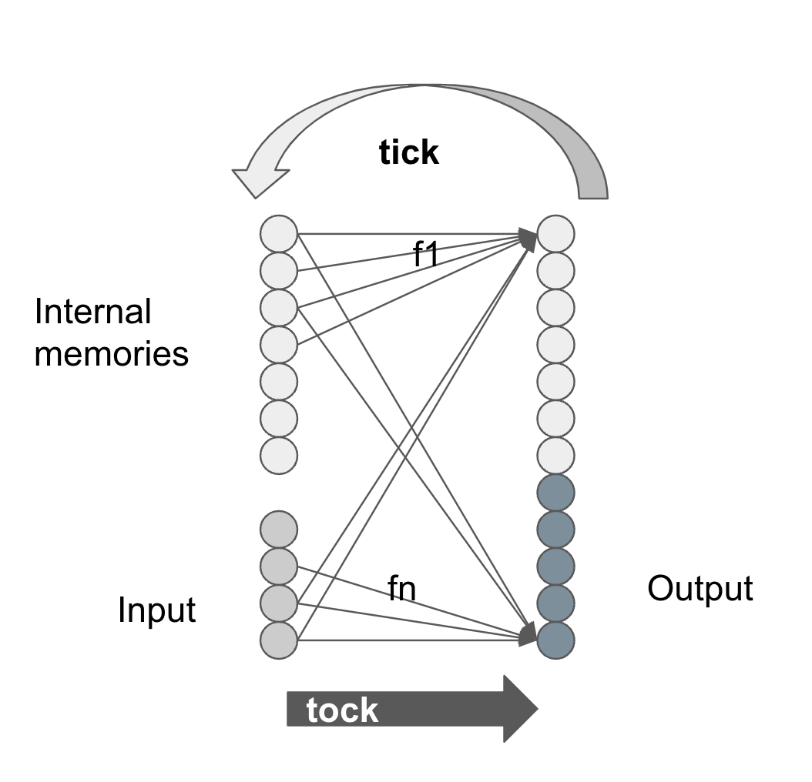

We can view a computer as:

* I: a set of input values
* M: a set of memory values
* O: a set of output values
* F: a set of combinational functions, for each $o \in O$, or $m \in M$, there is a function $f: (I, M)$, so we have $F: (I, M) \rightarrow (O, M)$ to compute every $o$, and $m'$

and there are two phases of operations:

* tick: load input values, load memory values: $I', M' \rightarrow I, M$
* tock: compute output values, and next memory values: apply $F: (I, M) \rightarrow (O, M')$




So FPGA is used to allocate FFs to form the nodes, organize LUT to form the combination functions F, and wire them up to form the solution.

## FPGA Design Flow
FPGA design is a hierarchical structure, starting from a top module with its inputs and outputs.

```verilog
// top_module.v

module top_module(input a, input b, output c);
    // ...
    assign c = a & b;
endmodule
```

To `build` the design, it takes some steps:

* design: functional requirements, performance requirements, and constraints, such as timing, power, area, etc. Decide the top module, and its inputs and outputs.
* HDL: write the Verilog code, which is a graph of modules and wires.
* synthesis: translate the Verilog code to a netlist, which is a graph of nodes and wires connecting gates. Some optimizations are applied.
* implementation: map the netlist to the FPGA, which is a graph of FFs and LUTs, RAMs, DSPs, etc. Physical placement and routing are applied.
* Timing analysis: check the timing constraints, and report the timing violations.
* Simulation: simulate the design, and check the simulation results.
* Programming: program the FPGA with the bitstream.

For the code example above, we have the top module with two inputs and one output. Now we can synthesize and implement it, and get the bitstream file:

using tcl (ticle) script to drive vivado:
```tcl
# impl.tcl
# synthesis
read_verilog -v top_module.v
read_xdc constraints.xdc
synth_design -top top_module -part xc7z020clg400-1
# implementation
opt_design
place_design
phys_opt_design
route_design
write_bitstream -force top_module.bit
```
Here we used the constraints file `z1top.xdc` to map the signals to the FPGA pins we use (pynq-z1 board).

```verilog
# constraints.xdc
# Buttons
set_property -dict { PACKAGE_PIN D19 IOSTANDARD LVCMOS33 } [get_ports { a }];
set_property -dict { PACKAGE_PIN D20 IOSTANDARD LVCMOS33 } [get_ports { b }];
# LEDs
set_property -dict { PACKAGE_PIN R14 IOSTANDARD LVCMOS33 } [get_ports { c }];
```

Run command:
```bash
vivado -nolog -nojournal -mode batch -source impl.tcl
```
Now it generates the bitstream file `top_module.bit`, which can be programmed to the FPGA.

```bash
vivado -nolog -nojournal -mode batch -source program.tcl
```

```tcl
# program.tcl
open_hw_manager

connect_hw_server -url localhost:3121
current_hw_target [get_hw_targets */xilinx_tcf/Digilent/*]
set_property PARAM.FREQUENCY 15000000 [get_hw_targets */xilinx_tcf/Digilent/*]
open_hw_target

current_hw_device [get_hw_devices xc7z*]

set_property PROGRAM.FILE top_module.bit [get_hw_devices xc7z*]
program_hw_devices [get_hw_devices xc7z*]
refresh_hw_device [get_hw_devices xc7z*]

close_hw_manager
```